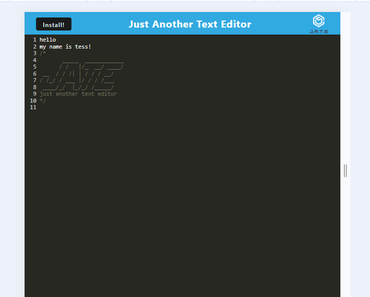

# Text Editor Starter Code

## Description
> As a developer, I want to create notes or code snippets with or without internet connection so that I can reliably retrieve them for later use. This is to be single-page application that meets PWA criteria.  
(adapted from the CWRU User Story)

## Table of Contents
I. [Acceptance Criteria](#acceptance-criteria)  
II. [Image of Working App](#example-of-working-application)  
III. [RENDER](#link-to-render)
IV. [Starter Code Credit](#starter-code-credit-httpsgithubcomcoding-boot-campcautious-meme)

### Acceptance Criteria (adapted from the CWRU Prompt)
>- GIVEN a text editor web app
>1. WHEN I open the app in my editor
>    - THEN I see a client server folder structure
>2. WHEN I run **'npm run start'** from the root directory
>    - THEN my application starts up the backend and serves the client
>3. WHEN I run the text editor app from my terminal
>    - THEN I find that my js files have been bundled using webpack
>4. WHEN I run my **webpack plugins**
>    - THEN I find that I have a generated HTML file, service worker, and manifest file
>5. WHEN I use next-gen js in my app
>    - THEN the text editor still functions in the browser without errors (babel)
>6. WHEN I open the text editor 
>    - THEN I find that **IndexedDB** has created a db storage
>7. WHEN I enter content and click off the DOM window
>    -THEN the content in text editor is saved with IndexedDB
>8. WHEN I reopen the text editor after closing
>    - THEN I find the content in text editor has been retrieved from >IndexedDB
>9. WHEN I click the Install Button
>    - THEN I download my web app as a desktop icon
>10. WHEN I load my web app
>    - THEN I have a registered **service worker** using **workbox**
>11. WHEN I register a service worker
>   - THEN I have my static assets pre-cached upon loading
>12. WHEN I deploy to **RENDER**
>   - THEN I have the proper build scripts for a webpack app

## Example of Working Application Image

## Link to Render
[Link Here!](https://pwa-npqe.onrender.com/)

### starter code credit: https://github.com/coding-boot-camp/cautious-meme